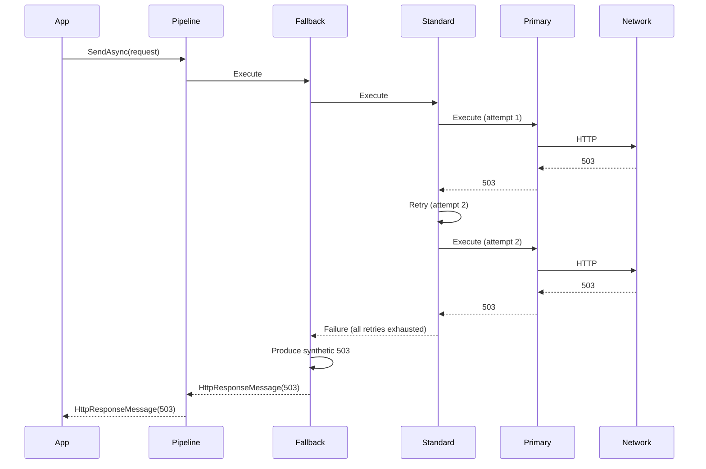

# Architecture and Pipeline Overview

This document gives a one-page view of how HttpResilience.NET fits together: handler stack, pipeline order, and per-authority selection.

---

## High-level flow

```
  Application code
        │
        ▼
  IHttpClientFactory.CreateClient("MyClient")
        │
        ▼
  ┌─────────────────────────────────────────────────────────────────┐
  │  Resilience pipeline (when Enabled = true)                      │
  │  Order depends on PipelineStrategyOrder or PipelineOrder +       │
  │  PipelineType. Outermost (first to execute) at top.               │
  ├─────────────────────────────────────────────────────────────────┤
  │  Optional: Fallback   (if Fallback.Enabled)                      │
  │  Optional: Bulkhead  (if Bulkhead.Enabled)                       │
  │  Optional: RateLimiter (if RateLimiter.Enabled / in order)       │
  │  Standard **or** Hedging (timeout, retry, circuit breaker, …)    │
  ├─────────────────────────────────────────────────────────────────┤
  │  Primary: SocketsHttpHandler (connection pool, connect timeout)   │
  └─────────────────────────────────────────────────────────────────┘
        │
        ▼
  Network (TCP/TLS to dependency)
```

---

## Pipeline order (simplified)

When **PipelineStrategyOrder** is set (e.g. `["Fallback", "Bulkhead", "RateLimiter", "Standard"]`), handlers are added so the **first element is outermost**:

| Position   | Strategy   | When added |
|-----------|------------|------------|
| Outermost | Fallback   | If Fallback.Enabled and in list |
|           | Bulkhead   | If Bulkhead.Enabled and in list |
|           | RateLimiter| If RateLimiter.Enabled and in list |
|           | Standard or Hedging | Exactly one; from PipelineType or list |
| Innermost | (primary)  | SocketsHttpHandler |

When **PipelineStrategyOrder** is not set, **PipelineOrder** (FallbackThenConcurrency vs ConcurrencyThenFallback) and **PipelineType** (Standard vs Hedging) determine order; see [IMPLEMENTATION.md](IMPLEMENTATION.md).

---

## Sequence: request with retry and fallback



---

## Per-authority pipeline selection

When **PipelineSelection:Mode** is **ByAuthority**:

- The same named `HttpClient` can call **multiple hosts** (e.g. `https://api-a.example.com` and `https://api-b.example.com`).
- A **separate pipeline instance** (and thus separate circuit breaker, rate limiter, etc.) is used per **authority** (scheme + host + port).
- So one failing host does not open the circuit for another.

```
  HttpClient("MultiHost")
        │
        ├── request to https://api-a.example.com  →  Pipeline instance A (circuit A, …)
        │
        └── request to https://api-b.example.com  →  Pipeline instance B (circuit B, …)
```

When **Mode** is **None** (default), a single pipeline instance is shared for all requests from that named client.

---

## Configuration and options flow

```mermaid
flowchart LR
    subgraph Config
        appsettings[appsettings.json]
        env[Environment / other sources]
    end
    subgraph Startup
        Bind[AddHttpResilienceOptions]
        Validate[ValidateOnStart (only when Enabled = true)]
        Register[AddHttpClient + AddHttpClientWithResilience]
    end
    subgraph Runtime
        Factory[IHttpClientFactory]
        Client[HttpClient]
        Pipeline[Resilience pipeline]
    end
    appsettings --> Bind
    env --> Bind
    Bind --> Validate
    Validate --> Register
    Register --> Factory
    Factory --> Client
    Client --> Pipeline
```

---

## References

- [IMPLEMENTATION.md](IMPLEMENTATION.md) – Option semantics and pipeline order in detail  
- [OPERATIONS.md](OPERATIONS.md) – Telemetry and alerts  
- [PRODUCTION-CHECKLIST.md](PRODUCTION-CHECKLIST.md) – Pre-go-live checklist
